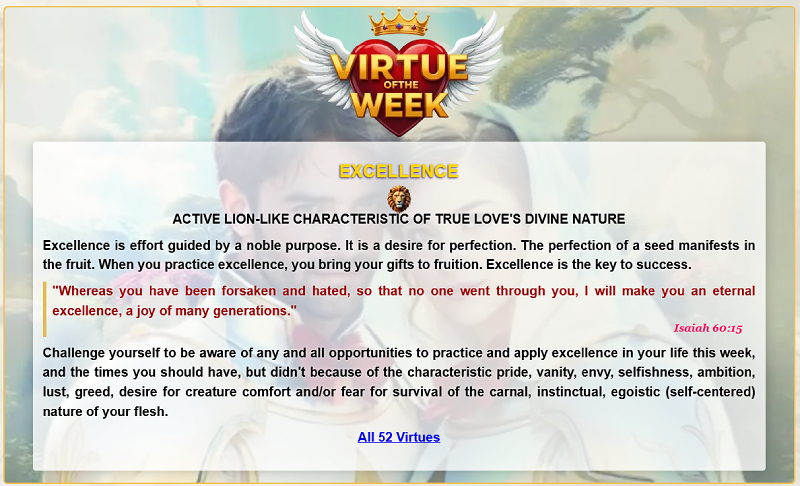

<a id="readme-top"></a>

<!-- PROJECT LOGO -->
<br />
<div align="center">
  <a href="https://github.com/LittleJohnAU/votw">
    
  </a>

  <h3 align="center">Add Our Virtue Of The Week To Your Website</h3>

  <p align="center">
    Our API allows you to display a different virtue on your website every week of the year which helps with SEO by updating content. We provide optional html, css and remote images for you to create the layout as shown in the screenshot below.
  </p>
<p>

</p>
</div>

<!-- TABLE OF CONTENTS -->
<details>
  <summary>Table of Contents</summary>
  <ol>
    <li>
      <a href="#about-the-project">About The Project</a>
    </li>
    <li>
      <a href="#getting-started">Getting Started</a>
      <ul>
        <li><a href="#prerequisites">Prerequisites</a></li>
        <li><a href="#installation">Installation</a></li>
      </ul>
    </li>
    <li><a href="#usage">Usage</a></li>
    <li><a href="#license">License</a></li>
  </ol>
</details>


<!-- ABOUT THE PROJECT -->
## About The Project
In this carnal, instinctual, egoistic (self-centered) world in which people, especially our children, grow more selfish, self-centered, disrespectful, uncooperative, unfaithful, untrustworthy, dishonest, etc. (unvirtuous), and generally more cold-hearted, it's important that those of us who believe in love and the characteristic virtues of its divine nature, do whatever we can to guide others into a higher more peaceful, graceful, gracious, friendlier life, and promote love and its characteristic virtues, to help enable people reach their full potential as a perfect gentleman or gentlewoman of true love or saint by another name. For as we say, evil (unvirtuousness) persists and grows, when good (virtuous) men and women do nothing.

The League of True Love is not a religious organization. Our motto and creed is; God IS love and love (therefore God) is not religious, carnal, instinctual or egoistic (self-centered and self-righteous) in any way, shape or form, but is characteristically, absolutely virtuous by nature.

While we are not religious, we are godly and are all about living for love according to its characteristic virtues, like perfect gentlemen and gentlewomen or saints by any other name and is why we freely provide our virtue of the week API for anyone who wants to add it to their website!

We also include a Bible reference as a bit of reinforcement, but using this, along with any of the data is entirely optional. We're not about getting people to religiously read, memorize and recite scriptures like parrots, we're about DOING what's best for the highest good (virtue) of all and betterment of this carnal, instinctual, egoistic (self-centered, self-righteous) world.

<p align="right">(<a href="#readme-top">back to top</a>)</p>

<!-- GETTING STARTED -->
## Getting Started

### Prerequisites

#### Domain Name
The only thing you need to get an API Key is a valid domain. The domain is like your username and upon application for a key, we check that the domain is valid and as we do not track the usage, we regularly visit each domain to ensure the API is being used appropriately and in good faith. If we find that it's not or isn't being used at all, we will delete the key and block the domain from applying for another one. If we simply find it's not being used, we will delete the domain and key from the record and if you choose to use it again, you can simply create another key for another key. 

#### PHP
To use our API you need to send a POST request using PHP curl. We are working on making it possible to use Javascript to send a request, but currently this method is unavailable due to cross domain issues. The **votw.class.php** file is a PHP class that you can include in your code and is all you need. The **example.php** file shows how you can simply and easily add it to your website and includes the HTML code and CDN CSS link to display it as in the screen shot.

### Installation

_To use the API, you must follow the steps as outlined below._

1. Get a free API Key at [https://api.tlotl.cyou](https://api.tlotl.cyou).
2. Save the API Key that's generated for your domain somewhere safe.
3. The post data must contain the domain and webp support. If you don't prefer to get the webp images if supported by the visitor's browser, you can just set this to 0. The **votw** PHP class however, includes a function that checks if webp is supported and sets it accordingly.
 ```sh
    private function supportsWebP() {
        $result = 0;
        // this detects if webp is supported by the visitor's browser
        if (isset($_SERVER['HTTP_ACCEPT'])) {
            if(strpos( $_SERVER['HTTP_USER_AGENT'], ' Chrome/' ) !== false ) {
              $result = 1;
            }
        }
        return $result;
    }
 ```
3. The response to a request is in JSON format as shown in this example
  ```sh
{
   "status":"success",
   "message":"valid request",
   "data":{
      "week":16,
      "gmtmod":1744552800,
      "title":"EXCELLENCE",
      "content":"Excellence is effort guided by a noble purpose. It is a desire for perfection. The perfection of a seed manifests in the fruit. When you practice excellence, you bring your gifts to fruition. Excellence is the key to success.",
      "verse":"\"Whereas you have been forsaken and hated, so that no one went through you, I will make you an eternal excellence, a joy of many generations.\"",
      "cite":"Isaiah 60:15",
      "character":"lion",
      "icon":"https:\/\/iili.io\/30EWNzg.webp",
      "logo":"https:\/\/iili.io\/30pqbkB.webp",
      "bgimage":"https:\/\/iili.io\/30EOjmN.webp",
      "characteristic":"active lion-like characteristic of true love's divine nature"
   }
}
  ```
The API runs on GMT time for global usage and we use the gmtmod timestamp on our website to tell search and other bots, that the page has been modified. This is done with a PHP header
 ```sh
header("Last-Modified: " . gmdate("D, d M Y H:i:s", (int)gmtdate) . " GMT");
 ```
And also the revised meta tag
 ```sh
<meta name="revised" content="<?php echo date('l, F j, Y', (int)gmtdate?>">
 ```

#### What is the function of the meta revised tag?
Google and other search engines rank sites better if they continue to have fresh content. This is one of the benefits of adding a virtue of the week to your website. The meta revised tag is used to tell Search Engine bots (Google, Yahoo!, Bing etc.) the Last Modified Date and Time of any Webpage in which you have made certain changes. Web crawlers may decide to update their index by reading this tag info on a web page and even more so if you also use the Last-Modified header. It's good SEO practice.

If there is an error, the status will read "error" with one of the following messages and no data
 ```sh
"Unauthorized access"
"Invalid API key"
"Invalid domain"
"Invalid request method"
"Invalid POST data"
 ```
<p align="right">(<a href="#readme-top">back to top</a>)</p>

<!-- USAGE EXAMPLES -->
## Usage
You can use the html, css and CDN image links we provide in the response and which we use in our websites, to display the virtue of the week as shown in the screenshot above.

The code we provide for your use is responsive and displays well on all devices.

You can include the minimized CSS file in your HTML using a CDN
 ```sh
<link rel="stylesheet" href="https://cdn.statically.io/gh/LittleJohnAU/votw/refs/heads/main/votw.min.css">
 ```
This is the HTML code we use to display the Virtue of the Week on our websites using the css in the file above. This code includes the PHP for outputting the variable in the response as used in the [example file](example.php)
 ```sh
<div class="votw" style="background-image:url('<?php echo $vw['bgimage']; ?>">
  <div class="votw-logo"> " alt="Virtue of the Week" width="319" height="200" loading="lazy"></div>
  <div class="frosted">
     <div class="votw-title"><?php echo $vw['title']; ?></div>
     <div>
        " width="36" height="45" alt="<?php echo $vw['character']; ?>" loading="lazy">
        <p class="votw-characteristic"><?php echo $vw['characteristic']; ?></p>
        <p class="votw-content"><?php echo $vw['content']; ?></p>
        <blockquote><?php echo $vw['verse']; ?><span></span><cite><?php echo $vw['cite']; ?></cite></blockquote>
        <p class="votw-content">Challenge yourself to be aware of any and all opportunities to practice and apply <?php echo strtolower($vw['title']); ?> in your life this week, and the times you should have, but didn't because of the characteristic pride, vanity, envy, selfishness, ambition, lust, greed, desire for creature comfort and/or fear for survival of the carnal, instinctual, egoistic (self-centered) nature of your flesh.</p>
        <p><a href="https://leagueoftrue.love/virtues" aria-label="The 52 virtues of true love" target="_blank" rel="noopener">All 52 Virtues</a></p>
     </div>
  </div>
</div>
 ```

_If you want to display it in a narrow column i.e. a sidebar, you can add the **compact** CSS class to the primary container_
  ```sh
<div class="votw compact">
  ```

<p align="right">(<a href="#readme-top">back to top</a>)</p>


<!-- LICENSE -->
## License

Distributed under the CC-BY-4.0 License. See `LICENSE.txt` for more information.

<p align="right">(<a href="#readme-top">back to top</a>)</p>

