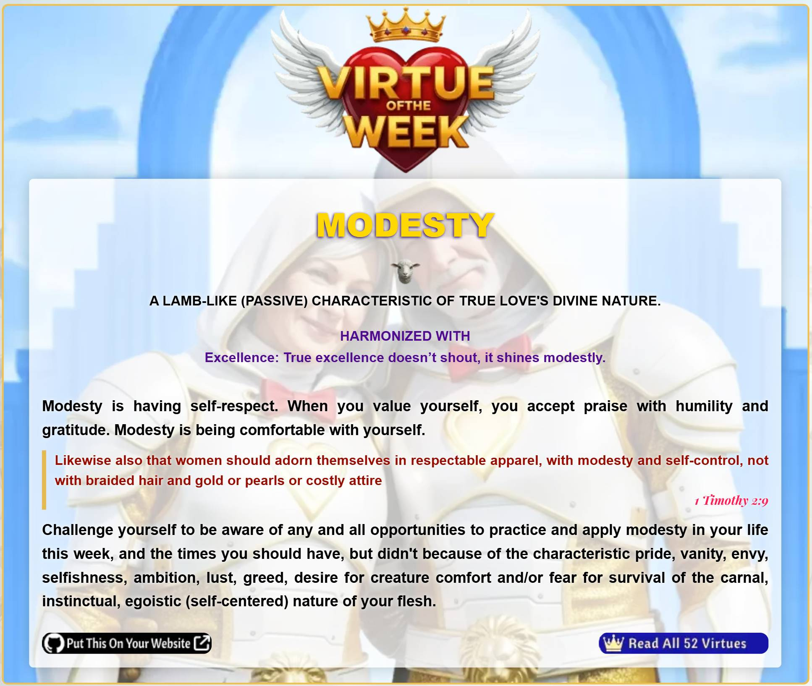

<h1>🌾 League of True Love Virtues API – PHP Integration Guide</h1>

  <blockquote>
    <em>“Truth that wounds ego but heals the soul.†
    A divine API for everyday saints.</em>
  </blockquote>

  <h2>✨ Overview</h2>
  
This API delivers poetic virtues—each with scripture, symbolism, tone, and pairings—to help you build spiritually resonant websites and applications.

  <ul>
    <li>Virtue of the Week</li>
    <li>Virtue of the Day</li>
    <li>Single Virtue by Title</li>
    <li>Virtues by Tone</li>
    <li>Virtue Pairings</li>
  </ul>
  
  ## 📝 Registration
  You need to register your domain for an API token on our [API Portal](https://api.tlotl.cyou)
  
  <h2>📦 Installation</h2>
  <pre><code>git clone https://github.com/LittleJohnAU/votw.git</code></pre>
  <pre><code>require_once 'virtue.class.php';</code></pre>

  <h2>🔧 Usage</h2>
  <pre><code>$virtue = new virtue('week');
$virtue = new virtue('day');
$virtue = new virtue('one', 'JOY');
$virtue = new virtue('tone', 'fiery');
$virtue = new virtue('pairings');
if ($virtue->hasError()) {
    echo "⚠️ Error: " . $virtue->get()['error'];
} else {
    $data = $virtue->get();
    // Render virtue card
}
// for debugging
print_r($virtue->debug());
</code></pre>
  
Each call returns a decoded JSON array. Session caching is built-in to reduce redundant requests.

  <h2>🧠 SEO & Caching Tips</h2>
  <pre><code>define("MODATE", strtotime($virt['gmtmod']));
$lastModified = gmdate("D, d M Y H:i:s", MODATE) . " GMT";
header("Last-Modified: " . $lastModified);</code></pre>

  <pre><code>&lt;meta name="revised" content="&lt;?= date("l, F j, Y", MODATE) ?&gt;"&gt;
&lt;meta http-equiv="last-modified" content="&lt;?= $lastModified ?&gt;"&gt;</code></pre>

  <h2>🎨 Styling</h2>
  
If you are using the Virtue of the Week, you can use our CSS and example files to style it as shown in the screenshot below.

  
  
  
  <h2>🎨 Tone Styling</h2>
  <pre><code>&lt;div class="tone-&lt;?= strtolower($virt['tone']) ?&gt;"&gt;
  &lt;!-- Your virtue card --&gt;
&lt;/div&gt;</code></pre>

  <ul>
    <li style="background: #fdf6f0;"><strong>tone-gentle</strong>: pastel clouds, soft fade-in</li>
    <li style="background:#ffe4e1;"><strong>tone-fiery</strong>: radiant sunburst, bold entrance</li>
    <li style="background:#f0f8ff;"><strong>tone-sacred</strong>: scroll reveal, dove flight</li>
    <li style="background:#f3e5f5;"><strong>tone-joyful</strong>: lavender sparkle, bounce animation</li>
    <li style="background:#f5f5f5;"><strong>tone-solemn</strong>: candlelight vignette, slow fade</li>
    <li style="background:#e0f7fa;"><strong>tone-radiant</strong>: celestial gradient, glow pulse</li>
  </ul>

  <h2>🕊️ Virtue Fields</h2>
  <table>
    <thead>
      <tr>
        <th>Field</th>
        <th>Description</th>
      </tr>
    </thead>
    <tbody>
      <tr><td>title</td><td>Name of the virtue (e.g. COURAGE)</td></tr>
      <tr><td>body</td><td>Poetic description</td></tr>
      <tr><td>scripture</td><td>Supporting Bible verse</td></tr>
      <tr><td>cite</td><td>Scripture reference</td></tr>
      <tr><td>icon</td><td>Symbolic icon (e.g. lion, lamb)</td></tr>
      <tr><td>pairings</td><td>Harmonious virtues with reflections</td></tr>
      <tr><td>tone</td><td>Emotional styling cue</td></tr>
      <tr><td>symbolism</td><td>Passive/active divine nature of true love</td></tr>
      <tr><td>gmtmod</td><td>Last modified GMT timestamp</td></tr>
    </tbody>
  </table>

  <h2>🔐 Authentication</h2>
  
All requests require a valid token. Replace <code>'YOUR_TOKEN'</code> in the class file with your actual token.

  <h2>📜 License & Mission</h2>
  
This project is part of the <strong>League of True Love</strong>, a divine mission to gather everyday saints through truth, beauty, and virtue. Use it freely, but reverently.

